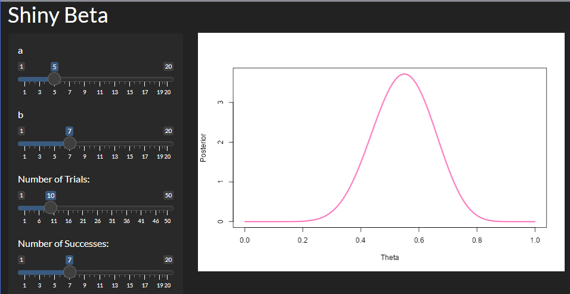

```{r, include = FALSE}
knitr::opts_chunk$set(
  collapse = TRUE,
  comment = "#>"
)
```

```{r setup}
library(RosaDSA5403lab3)
```

# Introduction

This package contains two functions which plot the posterior distributions of the conjugate pairs: Beta-Binomial and Gamma-Poisson. There is also an interactive Shiny app for the Beta-Binomial.

# Examples

## `myBetaCon()`

```{r}
myBetaCon(a = 5, b = 7, n = 10, x = 4)
```

## `myGammaCon()`

```{r}
myGamCon(a = 5, b = 7, n = 10, x = 4)
```

# `shinybeta()`

Here is a screenshot of the app running:



The shiny app can be accessed in an active `R` session by running the following code:

```{r, eval=FALSE}
shiny::runGitHub(repo = "RosaDSA5403lab3", username = "brandanrosa", subdir = "inst/shinybeta")
```


